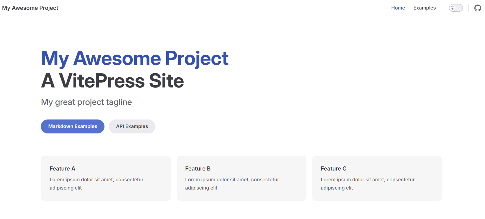

# 将博客部署到本地

## 1. npm换源

由于npm源在中国大陆访问不稳定，我们将npm源替换为淘宝的镜像源：

```
 npm config set registry http://registry.npmmirror.com
```

执行完成后查看是否设置成功：

```
 npm config get registry
```

如果结果为`http://registry.npmmirror.com`，说明设置成功。

若要恢复默认源，可以执行：

```
npm config set registry https://registry.npmjs.org
```

## 2. 新建项目

现在让我们新建一个文件夹，用来存放我们项目所用的文件：

```
mkdir Blog
cd Blog
```
通过`cd`命令进入到Blog目录下后，为项目安装VitePress并添加依赖：
```
npm add -D vitepress
```
运行如下命令开始设置项目的基础信息：
```
npx vitepress init
```
此时终端会依次显示以下内容：
```
┌  Welcome to VitePress!
│
◇  Where should VitePress initialize the config?（在哪里存放配置文件？输入docs即可。）
│  ./docs
│
◇  Site title:（输入一个喜欢的项目名字，后续可以在配置文件中更改。）
│  My Awesome Project
│
◇  Site description:（输入对项目的描述信息，随便写就行。）
│  A VitePress Site
│
◇  Theme:（选择主题，用键盘↑↓键切换选项，回车确认。这里我们用默认的，也就是直接回车。）
│  ● Default Theme (Out of the box, good-looking docs)
│  ○ Default Theme + Customization
│  ○ Custom Theme
◇  Use TypeScript for config and theme files?
│（是否将TypeScriptpt用于配置和主题文件？直接回车确认即可。）
│  ● Yes / ○ No
◆  Add VitePress npm scripts to package.json?
│（是否将VitePress npm 脚本添加到package.json中？这里也是回车确认。）
│  ● Yes / ○ No
│  Done! Now run npm run docs:dev and start writing.
└
```
至此一个`VitePress`项目就新建完成啦！让我们根据提示，试着启动服务：
```
npm run docs:dev
```
如果终端输出以下内容，说明后台服务已经成功启动：
```
> docs:dev
> vitepress dev docs
  vitepress v1.3.2
  ➜  Local:   http://localhost:5173/
  ➜  Network: use --host to expose
  ➜  press h to show help
```
现在打开同一台电脑上的浏览器，输入`http://localhost:5173/`访问，你将看到如下画面：

恭喜你！你已经成功搭建了一个本地博客，并且成功访问了它！

接下来我们将对博客的首页和导航栏等部分进行调整，让它更符合我们自己的审美。
