# 自用Gemini搭建流程

::: danger 声明
#### ⚠️ 本文内容仅供学习交流使用，请勿用于违法用途！
 
:::

由于Openai的ChatGPT和谷歌的Gemini都不对中国大陆开放，因而使用这两家的服务要依靠科学上网环境，且对代理服务器ip有一定要求。笔者本人之前就经常遇到节点被ban而无法访问的问题。好在我们可以用一些小技巧绕过这些限制——先用国外未被ban的服务器访问Gemini，然后再用其向我们提供服务。本教程将详细介绍如何搭建一个不用科学上网即可访问的Gemini服务。

## 1. 准备工作
虽然本教程旨在摆脱科学上网的限制，但搭建过程还是难免要用到相关工具。

该部分本已写好，不过由于我也不想进橘子喝茶，就请各显神通吧。总之只要有一个能够临时访问Gemini的代理就可以了，搭建完成后即可摆脱该限制。

## 2. 申请谷歌Gemini服务api key
接下来我们可以申请Gemini的api key了：https://aistudio.google.com/app/apikey

## 3. 部署Github项目
首先注册一个Github账号：

https://github.com

进入网站后点击右上角 __Sign up__，用邮箱注册即可。此过程较为简单，不在此赘述。
接下来访问此项目：

https://github.com/babaohuang/GeminiProChat

点击 __fork__ 按钮，在Repository name中可以任意起名（保持默认即可），然后点击 __Create fork__，即可创建一个fork。

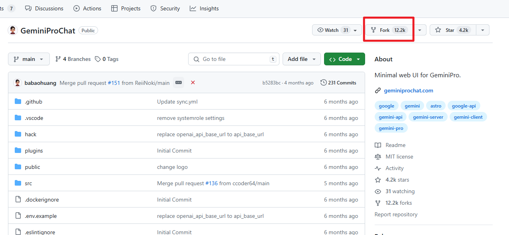

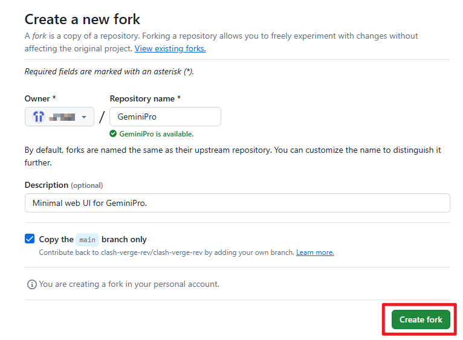

创建完fork后，我们可以在自己的仓库看到 GeminiProChat 项目了。
我们利用Vercel部署该项目，该网站提供免费的国外服务器，且操作简单，完美满足我们的需求。
Vercel网址：

https://vercel.com/login/

用Github账号授权登录vercel，可以很方便地导入Github上的项目。

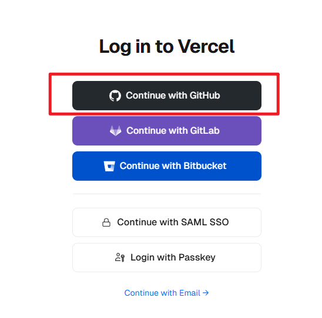

在Vercel首页点击 __Add New...__ 下的 __Project__，将跳转到导入Git仓库界面。

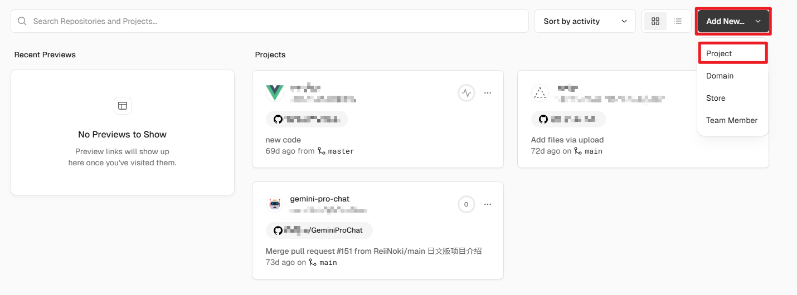

在该界面找到我们刚刚fork过来的项目，点击 __import__ 即可导入。

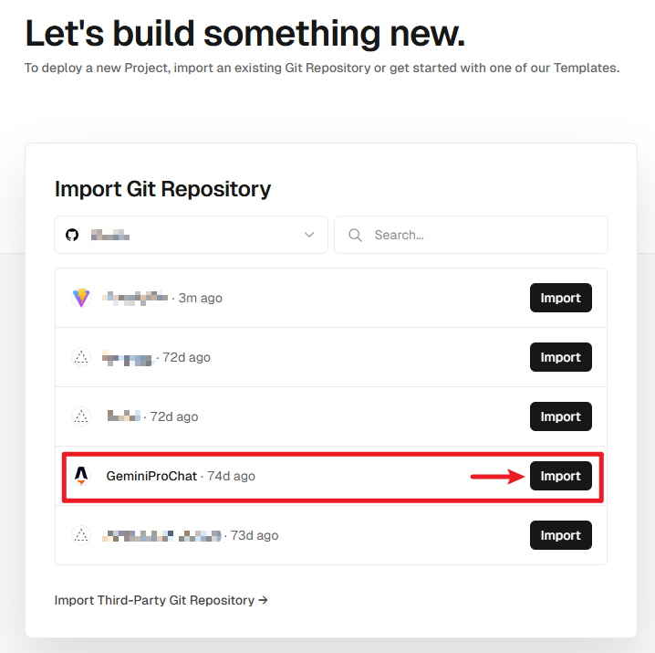

在Environment Variables中，填入Key：__GEMINI_API_KEY__,Value：__此处填入刚刚申请的api key__，点击 __Add__ 按钮，最后点击 __Deploy__。

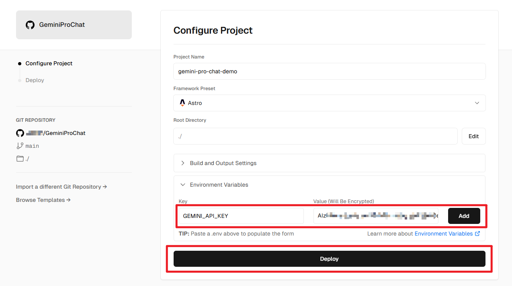

耐心等待部署，一般一分钟左右即可完成。看到如下界面即说明部署成功，此时点击 __Continue to Dashboard__ 按钮跳转到控制面板。

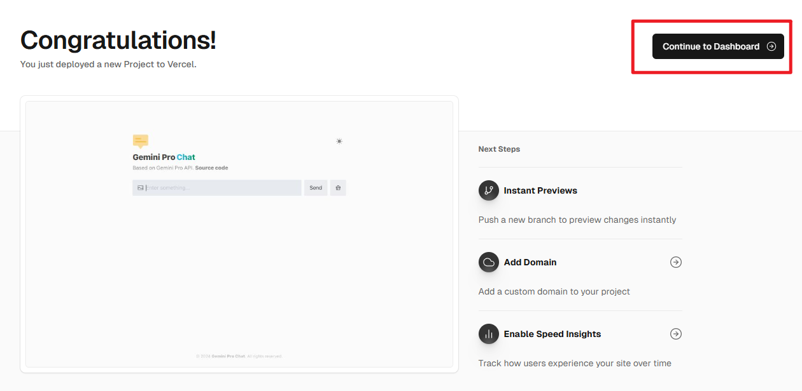

此时Vercel已经为我们分配了一个链接，点击这个链接或 __Visit__ 按钮即可访问Gemini了。不过现在这个链接还不能直接在国内访问。我们需要自己准备一个国内能够访问的域名，使其正确解析这个网址才行。

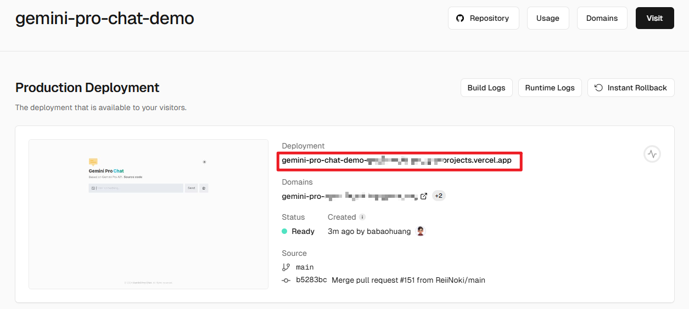

## 4. 获取域名

域名可以购买，也可以免费获得。不过免费获取的操作比较繁琐，如果不是喜欢折腾，还是建议买一个。本文也主要介绍第一种方式。

### 4.1 购买域名
国内在阿里云和腾讯云登平台购买域名均可，笔者是在阿里云购买的：

https://www.aliyun.com/

购买域名需要实名认证，按照网站提示完成即可。

注册完成后搜索自己想要的域名:

https://wanwang.aliyun.com/domain/

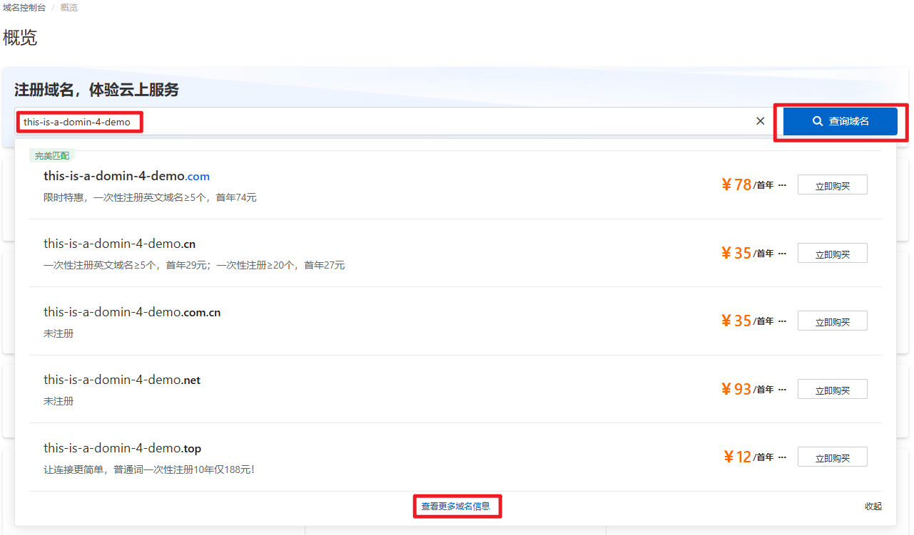

这里建议买一个便宜点的一级域名就行。
比如 __boomer.hi.cn__ 这样的是二级域名，而二级域名是有办法免费获取的，还是建议买 __boomer.asia__（只是个帮助理解的例子，实际内容可以根据需求调整）这类一级域名。

* 注意：__购买的域名是有期限的。__ 如果不确定自己要用多久，挑个便宜的买一年就可以，活动价几块钱就能拿下。

### 4.2 免费域名

注册Cloudns，每个账号可以获得一个免费的二级域名。但是这个二级域名貌似没法用来解析Vercel挂载的服务。需要自行编译GeminiProChat的项目代码，然后挂载到Github page上，再进行解析。这种方法原理上是能行得通的，不过笔者也尚未尝试，就留给感兴趣的读者尝试吧（或者我什么时候试了再把这部分补上）。

## 5. 设置域名解析

我们使用CloudFlare托管域名，并设置域名解析。

先注册一个CloudFlare账号：

https://dash.cloudflare.com/

然后在账号主页面点击右上角 __添加站点__。

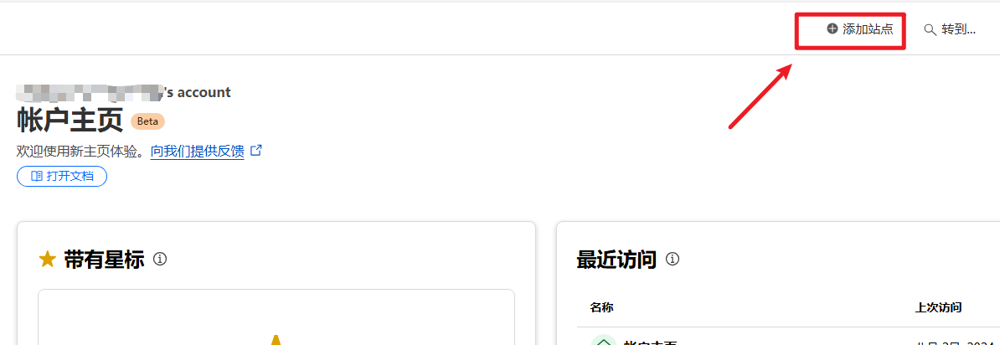

填入刚刚购买的域名，点击 __继续__。

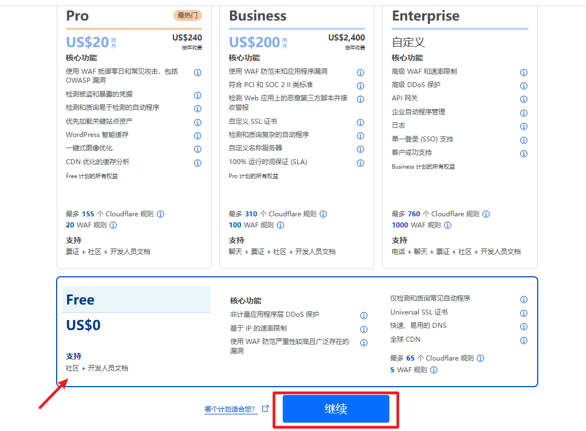

选择页面最下方的免费套餐，点击 __继续__。接下来让我们添加DNS记录，我们先跳过。

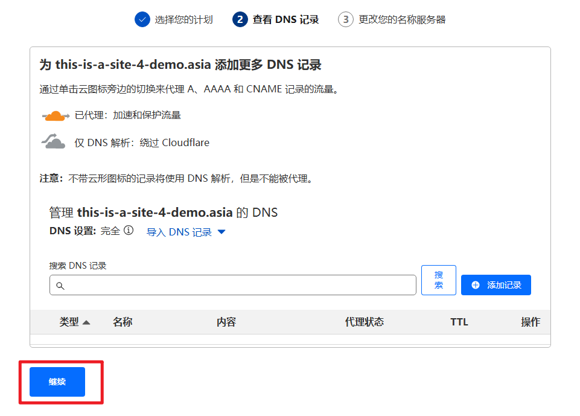

如果提示添加DNS记录，就继续跳过。

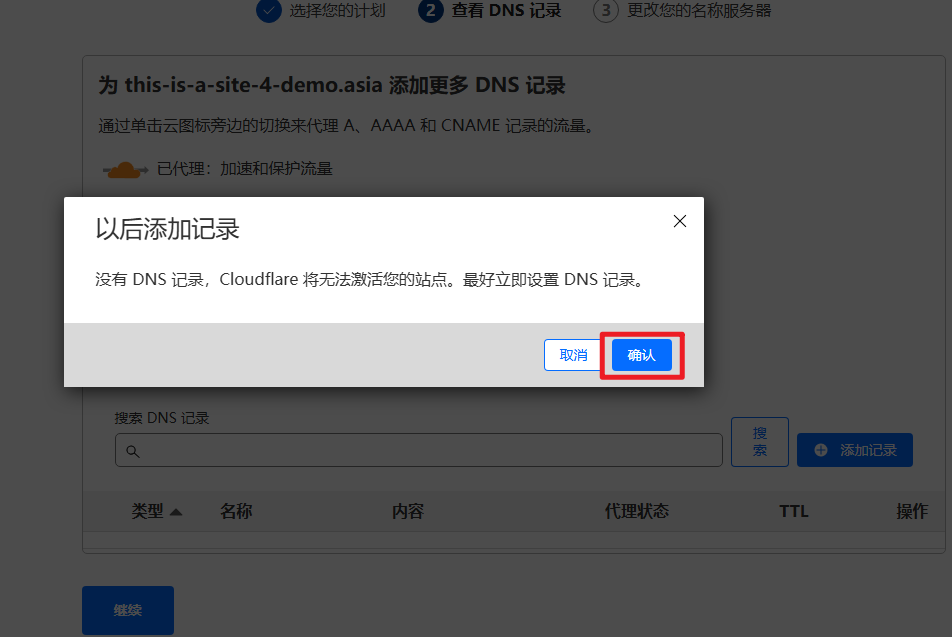

CloudFlare会为我们的站点分配两台DNS服务器，将它们复制并保存下来。点击页面最下方的 __继续__ 完成站点添加。

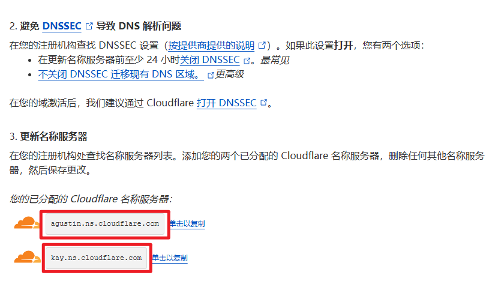
在CloudFlare的操作暂告一段落，接下来我们进入阿里云域名列表页面：

https://dc.console.aliyun.com/next/index#/domain-list/all

在域名列表中找到我们刚刚购买的域名，点击 __管理__。

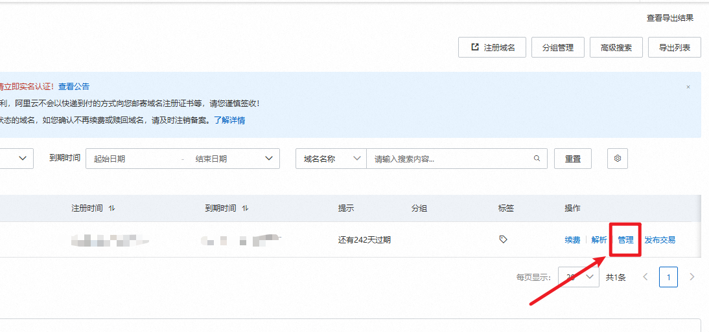

选择 __DNS管理-DNS修改__ 。

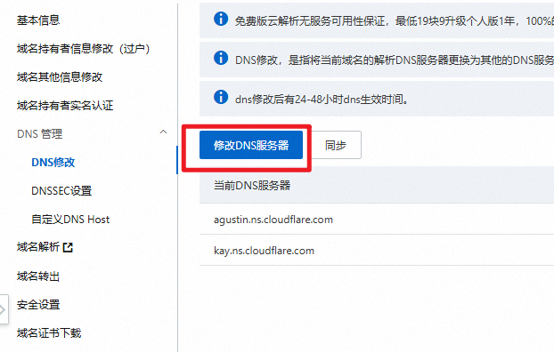

填入刚刚CloudFlare分配的DNS地址并确认保存。现在我们可以离开阿里云回到CloudFlare了。
进入账号主页，点击 __网站__，选择我们刚刚添加的域名进入域名管理，然后点击 __DNS记录__。

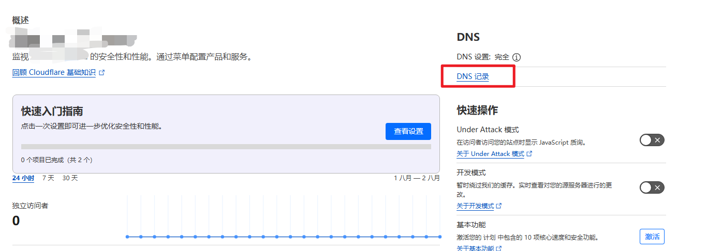

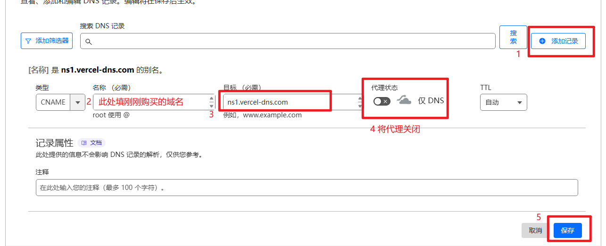

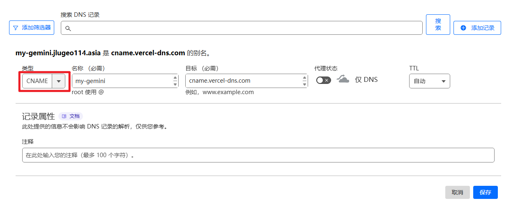

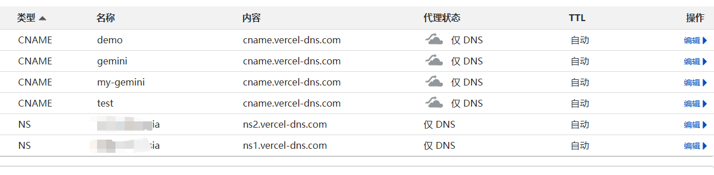
https://vercel.com/

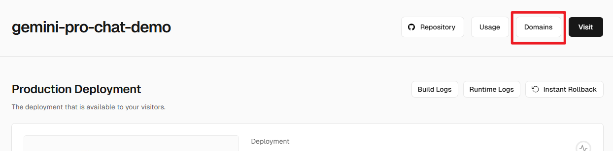

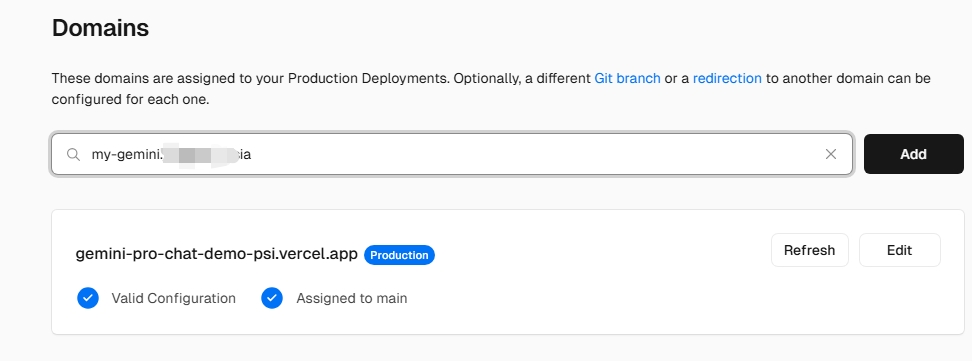

填入完整的域名，点击 __Add__。Vercel将会绑定该域名，而后该页面会显示 __Generating SSl Certificate...（正在生成SSL证书）__。

该提示一般几十秒后便会消失。恭喜你，现在可以关掉代理，直接访问Gemini了！
